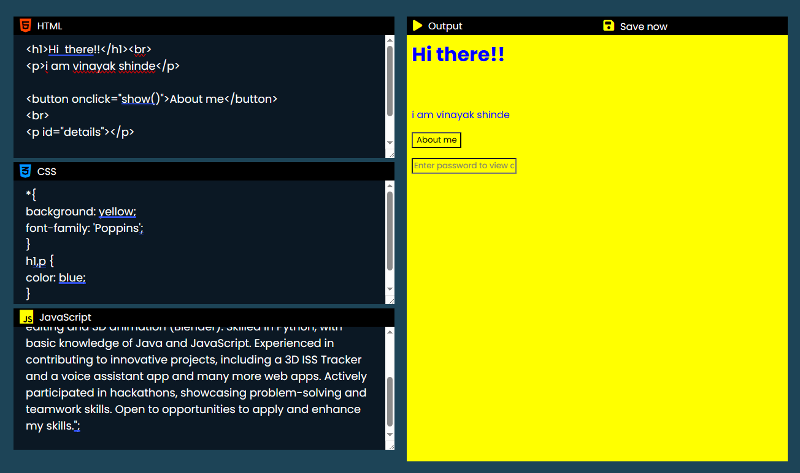
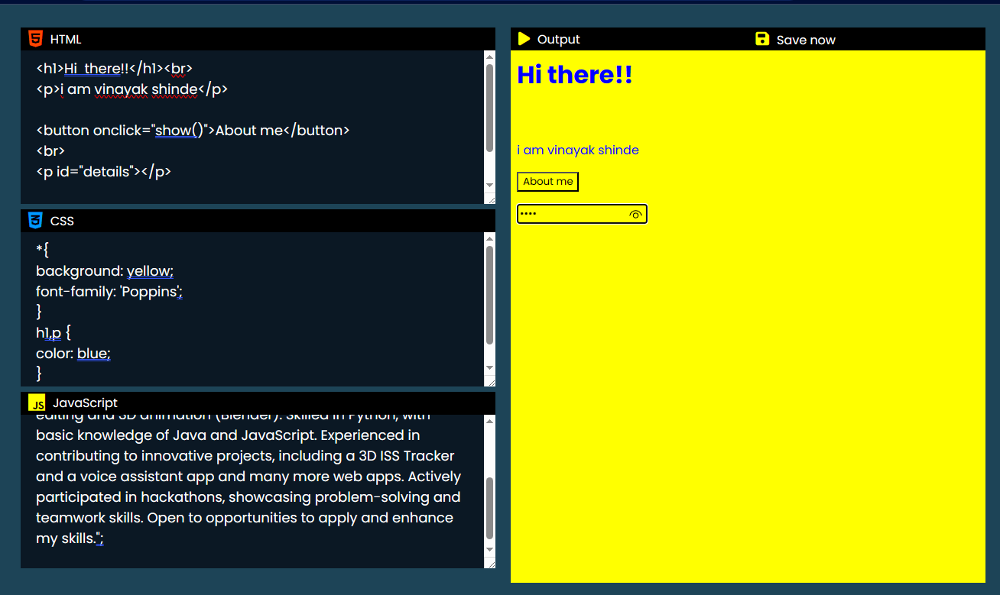
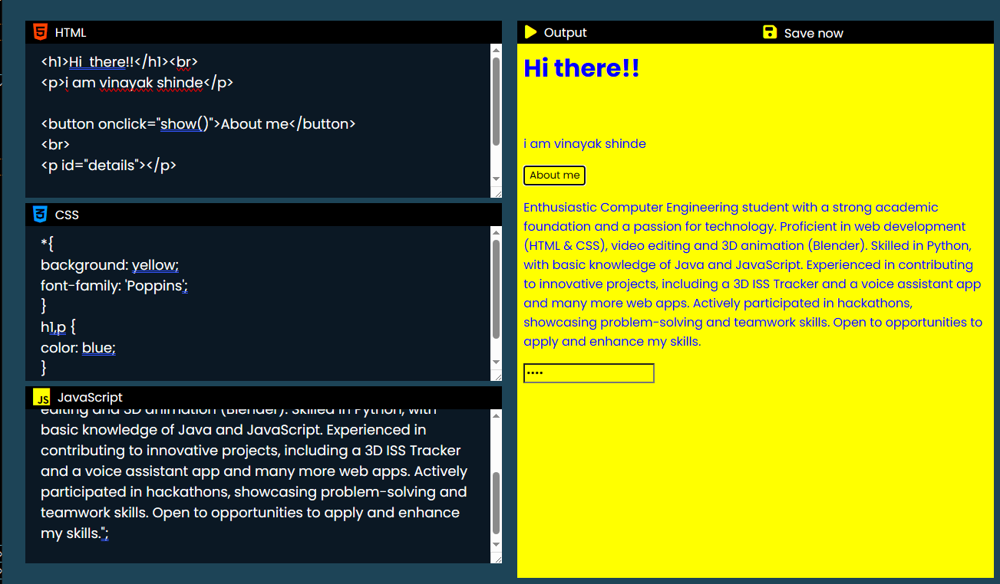
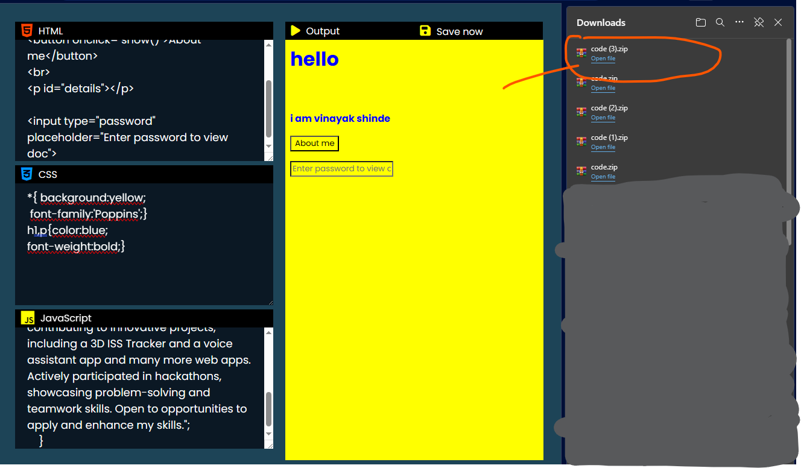

# Code Editor

Welcome to the Code Editor project! This web-based code editor allows you to write, test, and save your HTML, CSS, and JavaScript code effortlessly.

## Features

- **Multi-language Support:** Write code in HTML, CSS, and JavaScript, all in one place.
- **Live Preview:** Instantly see the output of your code in the embedded iframe.
- **Save Functionality:** Save your project as a ZIP file for easy download and sharing.

## Getting Started

1. Clone the repository to your local machine.
2. Open `index.html` in your preferred web browser.
3. Start coding in the provided text areas for HTML, CSS, and JavaScript.
4. Witness the live output in the embedded iframe.

## Usage

- Modify the code in the respective text areas.
- Observe the live preview in the output iframe.
- Save your project by clicking the "Save now" link.

## Save Project

Clicking the "Save now" link generates a ZIP file containing your HTML, CSS, and JavaScript files. The files are named `index.html`, `style.css`, and `index.js` respectively.

## Technologies Used

- HTML5
- CSS3
- JavaScript

## Preview

## How It Works

1. Enter your HTML code in the "HTML" textarea.
2. Add your CSS code in the "CSS" textarea.
3. Insert your JavaScript code in the "JavaScript" textarea.
4. Witness the live output in the embedded iframe.

Feel free to explore, modify, and enhance the Code Editor for your coding needs! If you encounter any issues or have suggestions, please open an [issue](#insert-issue-tracker-link-here) on GitHub.

Happy Coding! 🚀
